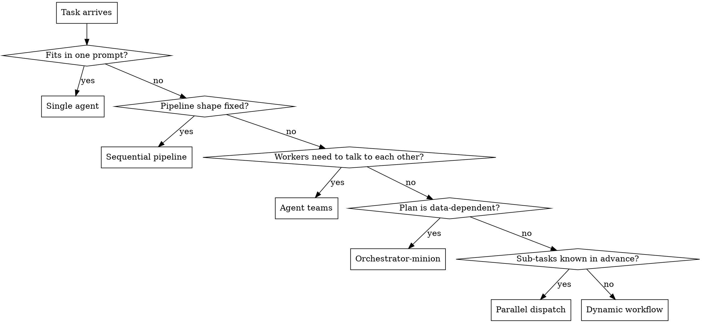

# Decision Menu: When to Reach for What

The orchestrator-minion pattern is one of several ways to structure a multi-step task. This
menu is the orchestrator's first stop after the skill loads. If the task does not clearly
match orchestrator-minion, do not force it. Pick the right primitive and move on.

## The six primitives (in increasing ceremony)

| Primitive | What it is | Cost shape | Best for |
|---|---|---|---|
| **Single agent** | One model, one prompt, one set of tools. | 1 LLM call per turn. | Tasks that fit in one head. One file, one fix, one question, one design. |
| **Sequential pipeline** | A fixed sequence of agents; each gets the previous's output. | N calls, summed latency. | Fixed shape: A → B → C, no branching. E.g. extract → transform → load. |
| **Parallel dispatch** | N independent agents, no coordination between them, no synthesis. | max(workers) latency, N calls. | Independent investigations whose results will be merged by the human or a fixed combiner. |
| **Orchestrator-minion** | One orchestrator plans and synthesizes; N minions execute atomic tasks. | 1 (orch) + N (workers) + 1 (synth). | Data-dependent decomposition; sub-tasks unknown until the input is read; sub-tasks must be independently verifiable. |
| **Agent teams** | Peer agents, shared task list, direct messaging between workers. | N parallel sessions, message overhead. | Workers need to *coordinate* with each other mid-flight (debate, claim work, share findings). |
| **Dynamic workflow** | The plan is a script the orchestrator writes; runtime executes it with isolated workers. | As above, but plan is in code, not context. | Codebase-wide sweeps, migrations, deep research; reproducible orchestration. |

(If you're counting: single agent, sequential pipeline, parallel dispatch, orchestrator-minion, agent teams, dynamic workflow — six total. The earlier version of this doc said "five" by mistake; the six is canonical and matches the flowchart below.)

## Decision flowchart

## When to definitely reach for orchestrator-minion

Concrete scenarios where the pattern is the right call:

- **Codebase audits with N independent files or modules.** "Audit every handler in src/foo/
  for missing auth checks." One worker per file (or batched up to 4–8 files per worker).
  Each worker returns a JSON finding list. Orchestrator synthesizes a P0/P1/P2 report.
- **Multi-source research.** "Find 5 sources for each of these 3 competing hypotheses."
  Workers parallelize the source-finding per hypothesis. Each returns a structured citation
  list. Orchestrator cross-references and synthesizes.
- **Independent refactor pre-checks.** "For each of these 12 modules, list every public
  function and its current complexity." Read-only, no inter-worker coordination needed.
- **Bulk content generation with a shared style.** "Write 8 marketing variants, each
  targeting a different audience." Workers don't need to talk; the orchestrator enforces
  the style guide at synthesis.

## When to NOT use orchestrator-minion (and what to use instead)

### "The task is one thing" → single agent

If a competent single agent can do it in one prompt, do not pay for an orchestrator + 5
workers + a verifier + synthesis. The pattern is *not* a default; it is a tool for
specific shapes.

Symptoms: the work is one file, one fix, one question, one design. The "decomposition"
would be artificial.

### "The shape is fixed and known" → sequential pipeline or parallel dispatch

If you can write the sub-tasks in advance, you do not need the orchestrator's planning
step. Two options:

- **Sequential**: when each step depends on the previous (transform A → transform B →
  load C).
- **Parallel dispatch**: when the sub-tasks are independent and you have a fixed combiner
  (often a single "merge" pass by the orchestrator model, but the plan itself is
  static). For parallel-dispatch without orchestrator coordination, see
  `dispatching-parallel-agents`.

### "Workers need to talk to each other" → agent teams

If the sub-tasks are not really independent — if worker B's scope depends on what worker
A found, mid-flight, with bi-directional updates — you have agent teams, not
orchestrator-minion. Different pattern, different tooling. Today in AI-OS that means
Claude Code's experimental agent-teams feature; in mavis, the `team` runtime (if/when
shipped).

Symptoms: workers need to share findings, debate, claim work, or revise their scope based
on peer output.

### "The plan needs to live in code" → dynamic workflow

If the orchestration is reproducible enough that you want the plan to be a script (so
you can re-run it, version it, or watch it execute), you want a dynamic workflow. The
plan is generated by the orchestrator, but then lives in the filesystem. The runtime
executes the script with isolated workers per step. See `reference/mavis-binding.md`
for how this would look in AI-OS.

Symptoms: the user wants the same audit run on a different codebase tomorrow, the
orchestration is non-trivial (10+ workers, staged), or you want resumable runs.

## Anti-pattern: the orchestrator doing the work

The single most common failure mode in practice is the orchestrator-minion skill being
loaded but the orchestrator doing most of the work anyway. The "minions" become a
formality; the orchestrator reads files, makes decisions, writes summaries, and the
workers are dispatched with vague scopes that match the orchestrator's already-done
work.

Symptoms:
- The orchestrator transcript shows file reads between spawn and synthesis.
- Worker artifacts are tiny or trivial.
- The user could not tell the difference between this run and a single-agent run, except
  it took longer and cost more.

Fix: if the pattern is loaded, the orchestrator commits to it. If mid-run the
orchestrator realizes the pattern is wrong, it stops, retracts the workers (best
effort), and reports the decision to the user. Half-running the pattern is the worst
option.

## Related implementations

The orchestrator-minion pattern is implemented in several places. They are not
competitors — they are different opinions about the same pattern, with different
trade-offs. The orchestrator-minion skill in this repo is the portable contract;
the implementations below are opinionated variants.

### Fable Foreman (Claude Code skill, MIT, v0.2.0)

Jordan Olsen's [Fable Foreman](https://github.com/olsenbrands/fable-foreman) is a
free, open-source Claude Code skill that implements the orchestrator-minion pattern
with three opinionated choices:

1. **Multi-provider out of the box** — Claude + optional OpenAI Codex, discovered
   at runtime, consent-gated. The orchestrator routes by judgment class
   (FRONTIER / WORKHORSE / FAST) to the cheapest model that clears the quality
   bar. The orchestrator-minion skill in this repo is single-CLI and uses
   `model_tiers` per worker role; Fable's judgment classes are a more
   opinionated default.
2. **Blind verifier as the default** — the verifier sees only the original user
   request, fresh context, read-only tools, and must reproduce the evidence.
   The orchestrator-minion skill in this repo defaults to explicit rejects
   (the verifier sees the worker's scope + a `rejects_if` list); Fable's
   blind reproduction is a stronger default for tasks where "answers the
   original question" is the actual acceptance criterion. Both patterns
   ship in this repo as alternatives (see `reference/verifier-patterns.md`).
3. **Adapts to capabilities of the host** — five modes, from full
   orchestration down to "discipline mode" on Claude Desktop (which cannot
   spawn parallel agents; Fable is honest about the limits). The
   orchestrator-minion skill in this repo is CLI-agnostic and assumes a
   CLI that can spawn; Fable is the better choice when the host is
   Desktop.

**When to use Fable Foreman instead of this skill**: when you are on Claude
Code AND want multi-provider routing AND want the blind verifier as the
default AND want the host-adaptive modes. Install Fable alongside this
skill; the patterns are compatible.

**When to use this skill instead of Fable**: when you want a portable contract
that runs on Claude Code, Codex, Gemini, or OpenCode. When you want
plan-first validation (run the plan through `plan.mjs validate --strict`
before dispatching). When you want the 7-invariants contract as a hard
floor rather than a style preference.

### Gentle Programming "Orquestador-Minion" (YouTube, 2026)

The Spanish term *Orquestador-Minion* comes from Gentleman Programming's
gentle-ai project. The pattern is the same; the framing is "your best
model plans and reviews, your cheaper model does the typing" — a more
conversational take than either Fable's "foreman" or this repo's
"orchestrator". The skill in this repo is a formalization of that
framing into a portable contract with explicit validation.

### Anthropic Orchestrator-Workers (Dec 2024)

The original published name. Anthropic's documentation is the source
of the four-pattern taxonomy in the table at the top of this file. The
orchestrator-minion skill here is a CLI-agnostic re-implementation
designed to work across the AI-OS supported harnesses, not just
Claude Code.
